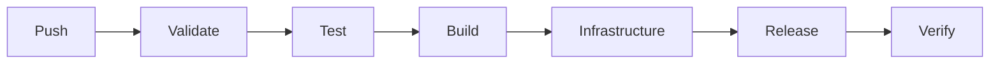

# Azure DevOps pipeline

CI validates source, runs the calculator and diary tests, and creates a checksum-protected ZIP. Azure deployment is opt-in through `deployAzure` and requires a federated Azure service connection and Blob state backend. Review Terraform plans and costs before applying resources. Deployment is restricted to main. SQLite on App Service is a single-instance demonstration setup; use a managed database for scalable production.

Create the backend with `scripts/bootstrap.ps1`, configure pipeline variables, and create branch build validation for Azure Repos pull requests.
